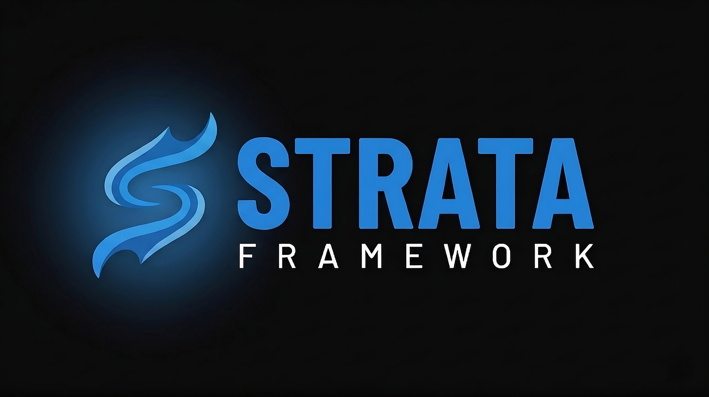

<div align="center">



### A complete, batteries-included FiveM roleplay framework built on `ox_core`.

<br>

[](https://github.com/StrataFW/strata-recipe/releases/latest)
[](https://github.com/StrataFW/strata-recipe/actions/workflows/bundle.yml)
[](./LICENSE)
[](https://github.com/overextended/ox_core)

[**Deploy**](#-deploy) · [**What's inside**](#-whats-inside) · [**After deploy**](#-after-deploy) · [**Updating**](#-updating) · [**Layout**](#-layout)

</div>

---

## ⚡ Deploy

### Option A &mdash; one-click txAdmin recipe (recommended)

In **txAdmin → New deployment → Remote recipe**, paste:

```
https://raw.githubusercontent.com/StrataFW/strata-recipe/main/recipe.yaml
```

txAdmin downloads everything, writes the cfg tree, validates your database
connection. Provide your `mysql_connection_string` when prompted.

### Option B &mdash; frozen bundle

Grab `strata-framework-vX.Y.Z.zip` from the [latest release](https://github.com/StrataFW/strata-recipe/releases/latest)
and unzip into your FXServer directory. Everything is pre-staged.

---

## 📦 What's inside

The recipe assembles three layered resource groups, plus a clean cfg tree:

<table>
<tr><th align="left">Layer</th><th align="left">Source</th><th align="left">Resources</th></tr>
<tr>
  <td>🟢 <code>[cfx]</code></td>
  <td><a href="https://github.com/citizenfx">citizenfx/*</a></td>
  <td><code>cfx-server-data</code> (gameplay / gamemodes / managers / system) · <code>screenshot-basic</code></td>
</tr>
<tr>
  <td>🔵 <code>[ox]</code></td>
  <td><a href="https://github.com/overextended">overextended/*</a></td>
  <td><code>oxmysql</code> · <code>ox_lib</code> · <code>ox_core</code> · <code>ox_target</code> · <code>ox_inventory</code> · <code>ox_banking</code> · <code>ox_commands</code> · <code>ox_doorlock</code> · <code>ox_fuel</code></td>
</tr>
<tr>
  <td>🟣 <code>[strata]</code></td>
  <td><a href="https://github.com/StrataFW">StrataFW/*</a></td>
  <td><code>st_log</code> · <code>st_bootstrap</code> · <code>st_ipl</code> · <code>st_multichar</code> · <code>st_spawn</code> · <code>st_chat</code> · <code>st_apartments</code> · <code>st_admin</code> · <code>st_appearance</code></td>
</tr>
</table>

### Strata resources at a glance

| Resource         | Purpose                                                                          | Repo |
|------------------|----------------------------------------------------------------------------------|------|
| `st_log`         | Structured logging — pretty console, file, NDJSON, Discord, redaction, rotation  | [↗](https://github.com/StrataFW/st_log)        |
| `st_bootstrap`   | Branded loadscreen + boot summary card                                           | [↗](https://github.com/StrataFW/st_bootstrap)  |
| `st_ipl`         | IPL / interior loader with dependency ordering                                   | [↗](https://github.com/StrataFW/st_ipl)        |
| `st_multichar`   | Character selector — replaces `ox_core`'s built-in                               | [↗](https://github.com/StrataFW/st_multichar)  |
| `st_spawn`       | Spawn / respawn flow + last-location memory                                      | [↗](https://github.com/StrataFW/st_spawn)      |
| `st_chat`        | Chat replacement — Mantine UI, channels, command suggestions                     | [↗](https://github.com/StrataFW/st_chat)       |
| `st_apartments`  | Per-character apartment system (paired with `kiiya_lapuerta` MLO)                | [↗](https://github.com/StrataFW/st_apartments) |
| `st_admin`       | Staff panel — permissions, notes, reports, vehicles, bans                        | [↗](https://github.com/StrataFW/st_admin)      |
| `st_appearance`  | Appearance editor — clothing, hair, tattoos, outfits, presets, sharing, uniforms | [↗](https://github.com/StrataFW/st_appearance) |

> 🎨 Every NUI resource ships **with source** &mdash; `web/src`, `package.json`,
> `vite.config.ts`, `bun.lock`. Fork, edit, rebuild.

---

## ✅ Prerequisites

|                |                                                                              |
|----------------|------------------------------------------------------------------------------|
| 🟦 **FXServer** | artifact `>= 6552` (cerulean)                                                |
| 🟧 **Database** | MariaDB / MySQL with `utf8mb4` default charset                               |
| 🟨 **OneSync**  | enabled in txAdmin's settings page (the recipe declares `$onesync: on`)      |
| 🔑 **License**  | a Cfx.re key &mdash; [keymaster.fivem.net](https://keymaster.fivem.net)     |

> ✨ All Strata + OX tables **auto-create on first boot** &mdash; no SQL setup step.

---

## 🔧 After deploy

The recipe never ships secrets. On the server, after deploy completes:

```bash
cd <deploy-path>
cp cfg/secrets.cfg.example    cfg/secrets.cfg
cp cfg/principals.cfg.example cfg/principals.cfg
```

Edit:

- 🔐 **`cfg/secrets.cfg`** &mdash; `sv_licenseKey` + `mysql_connection_string`.
  Optionally `steam_webApiKey`, `st:log:webhook` (Discord URL for warn/error
  log forwarding).
- 👥 **`cfg/principals.cfg`** &mdash; map real players to staff tiers.
  Hierarchy (highest → lowest): `dev > sudo > admin > mod > jrmod`.

Hit **Start** in txAdmin. `st_bootstrap` shows a branded loadscreen,
`st_log` prints a boot summary card, you're live.

---

## 🧩 Optional add-ons

Two Strata resources ship installed but **commented out** in
`cfg/resources.cfg`:

- 💬 **`st_discord`** &mdash; Discord rich presence + role sync
- 🐞 **`st_debug`** &mdash; dev-only inspector / overlay

Two paid / third-party slots are stubbed:

- 🏠 **`kiiya_lapuerta`** &mdash; La Puerta MLO (required for `st_apartments` zones)
- 🎬 **`[assets_corefx]`** &mdash; graphics / visual overhaul pack

Drop the asset into `resources/` and uncomment the matching line.

---

## 🔄 Updating

Every resource publishes its own per-resource release. To refresh everything
in one shot, fire the bundle workflow:

```bash
# Authenticated as someone with write access to StrataFW/strata-recipe
gh workflow run Bundle --repo StrataFW/strata-recipe -f tag=v1.0.1
```

- Leave `tag` blank → artifact-only run (nightly snapshot)
- Set `tag=vX.Y.Z` → cuts a new GitHub Release with `strata-framework-vX.Y.Z.zip` attached

The bundle workflow also runs **automatically every Monday at 06:00 UTC** to
keep nightly artifacts fresh against upstream `[cfx]`, `[ox]`, and `[strata]`
release zips.

---

## 📁 Layout

```
server/
├── server.cfg                       ← entrypoint (execs cfg/* in order)
├── cfg/
│   ├── identity.cfg                 ← hostname, capacity, network
│   ├── runtime.cfg                  ← onesync, game build, console
│   ├── convars.cfg                  ← ox + strata convars
│   ├── permissions.cfg              ← ACE rules + tier hierarchy
│   ├── resources.cfg                ← grouped start order
│   ├── principals.cfg.example       → copy to principals.cfg
│   └── secrets.cfg.example          → copy to secrets.cfg
└── resources/
    ├── [cfx]/                       ← stock citizenfx
    ├── [ox]/                        ← overextended ecosystem
    └── [strata]/                    ← StrataFW resources
```

---

## 🛠 How it's built

This repo contains:

| File                              | What it does                                                                 |
|-----------------------------------|------------------------------------------------------------------------------|
| `recipe.yaml`                     | txAdmin deploy recipe &mdash; defines the layout, fetches every resource    |
| `server.cfg` + `cfg/*.cfg`        | The cfg tree shipped to every deployment                                     |
| `.github/workflows/bundle.yml`    | CI that builds the fat `strata-framework-vX.Y.Z.zip` and cuts releases       |
| `RELEASE_NOTES.md`                | Source-of-truth body for the bundle release                                  |

Resources themselves live in their own repos under the [StrataFW org](https://github.com/StrataFW)
&mdash; each has its own `release.yml` that publishes a zip on `v*.*.*` tag push.

---

## 🐛 Support

- **Per-resource bugs** → file on the resource repo (e.g. [`StrataFW/st_chat`](https://github.com/StrataFW/st_chat/issues))
- **Recipe / deploy bugs** → [file here](https://github.com/StrataFW/strata-recipe/issues)

---

<div align="center">

Built on `ox_core` by <a href="https://github.com/okIndica">okIndica</a> ⚡

</div>
